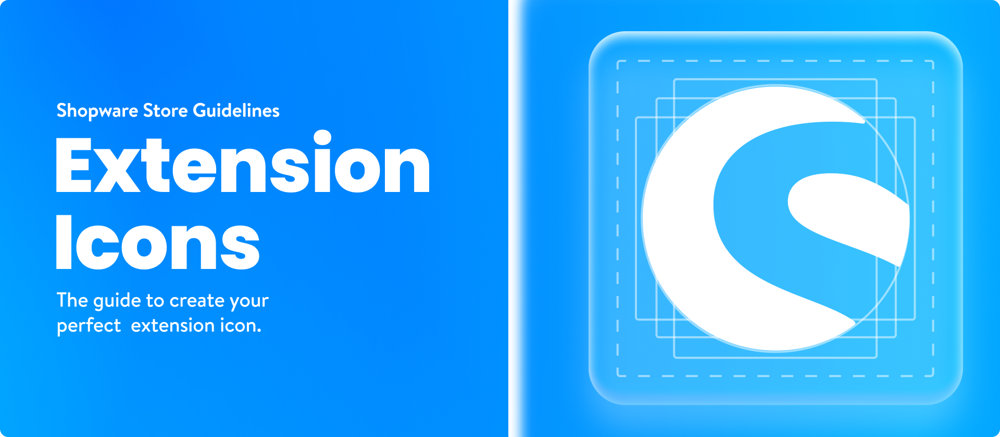
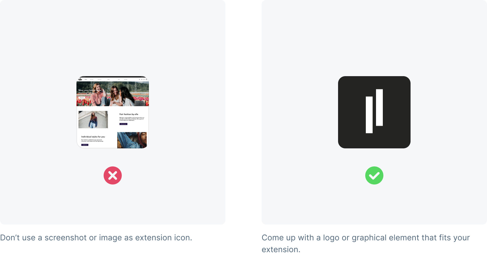
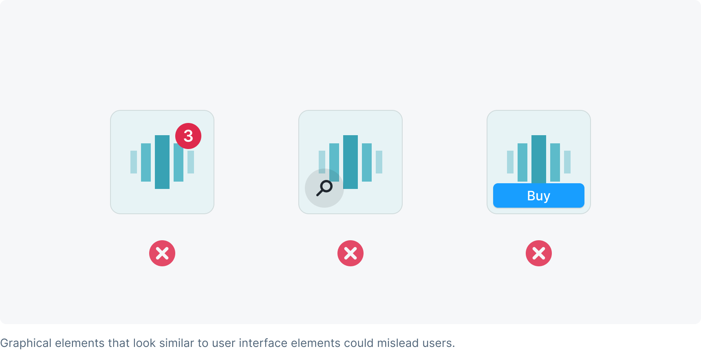
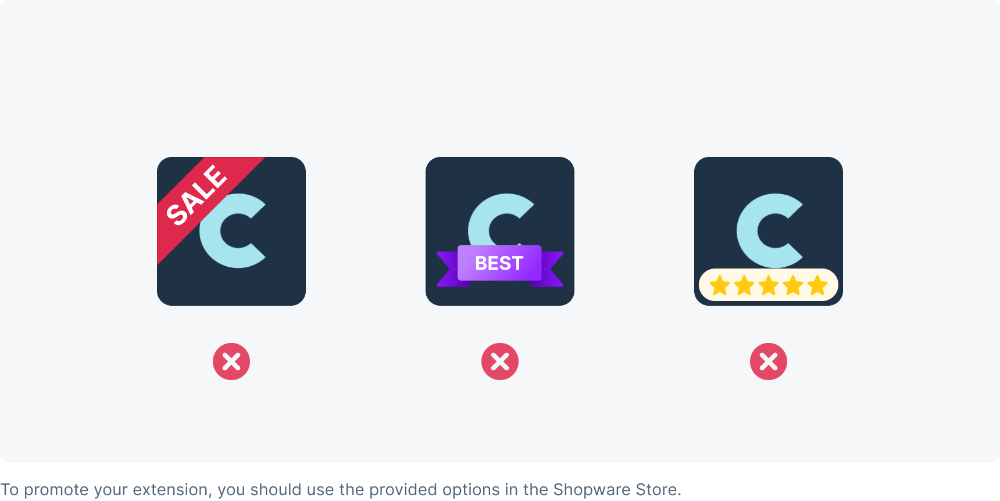
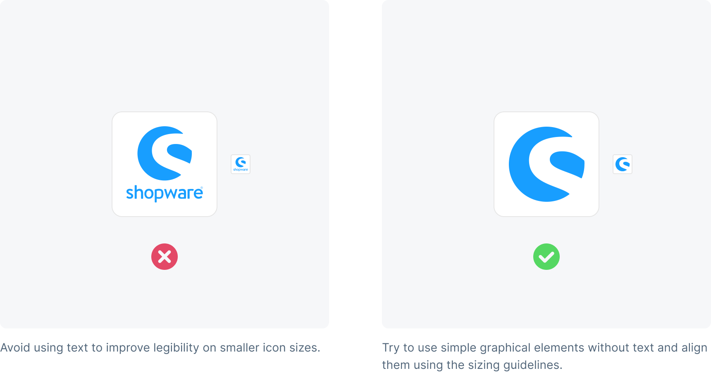
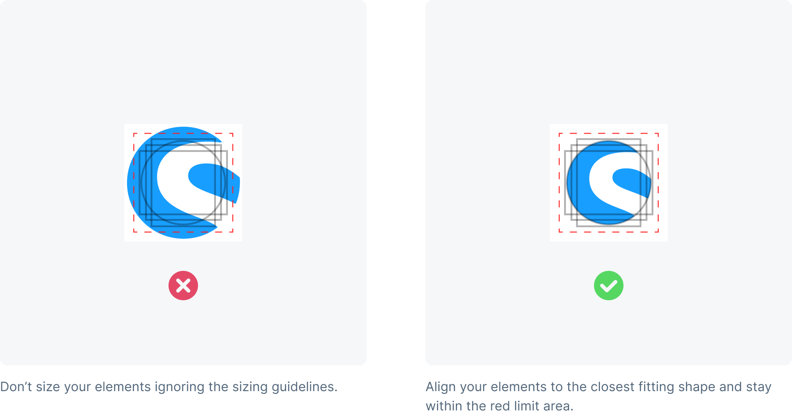
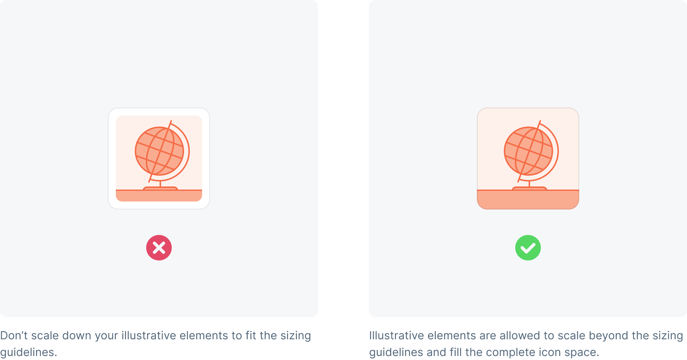
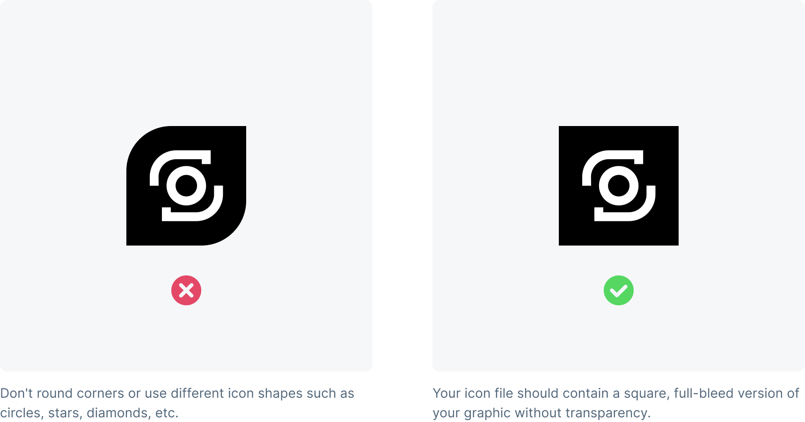
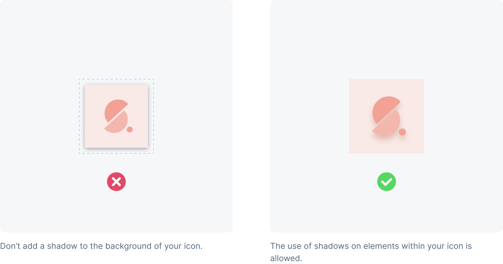

# Extension Icon Guidelines

## Why do we need guidelines?

Icon guidelines are crucial for ensuring that all extension icons fit seamlessly into Shopware UI layouts and avoid any alignment issues. By providing consistency between icons, the result is a cleaner and more uniform look that is visually appealing and easier to digest for our users.
Additionally, it ensures that all icons are of similar quality, making it easier for customers to differentiate between different extensions and make informed decisions when choosing which ones to purchase.

## Building the icon

### Technical requirements

- **Size:** 128x128 pixels
- **Format:** PNG (recommended) or JPEG
- **No transparency** (we will replace all transparency with a white background as fallback)
- **Shape:** Full-bleed square (rounded corners, shadows, borders or similar will be added by our applications related to the use case)

### Elements

You should always prefer graphical elements or logos to photos or screenshots in your icon designs.

Don’t use graphical elements that look close or identical to user interface elements such as buttons, notification badges, checkboxes, switches or similar.

Don't use promotional elements like "SALE" banners or similar, which imply a ranking or sale status of your extension.

To prevent text from becoming unreadable at smaller icon sizes, try to avoid using written elements whenever possible.

### Sizing

Try to position elements such as logos using the sizing guidelines provided. To do this, align them to the closest fitting shape and stay within the red limit area.

Supporting, illustrative elements are allowed to extend beyond the red limit area of the sizing guidelines. However, you should always try to keep your main elements within these guidelines.

### Background and Shape

You should provide your icon with a full-bleed, square background. We will fallback to a white background color for any transparent area.

Don't round corners or use different icon shapes such as circles, stars, diamonds, etc. in your icon file. The shape of the icon is automatically defined by Shopware products.

Don’t add drop shadows to the background of your icon. You can, however, use shadows within your icon design.

### Adaptation of existing Logos

To adapt your existing brand to the Shopware Store icon guidelines, try the following:

- Scale and position elements according to the sizing guidelines
- Try to adjust the icon background color to best match your brand
- Don't force your logo to fill the entire icon space

### Download design template

- [Figma](FigmaCommunityFile.com)
- [Sketch](../../.gitbook/assets/shopware-extension-store-icon-guidelines-sketch.sketch)
- [Adobe Illustrator](../../.gitbook/assets/shopware-extension-store-icon-guidelines-ai.ai)
- [Adobe XD](../../.gitbook/assets/shopware-extension-store-icon-guidelines-xd.xd)
- [Adobe Photoshop](../../.gitbook/assets/shopware-extension-store-icon-guidelines-ps.psd)
